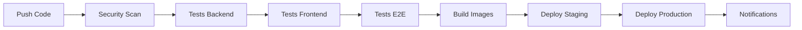

# 🚀 Guide CI/CD - Gestion Hospitalière

> Documentation complète du pipeline d'intégration et déploiement continu

---

## 📋 Vue d'Ensemble

### Pipeline Architecture


### Workflows Disponibles
- **enhanced-ci-cd.yml** : Pipeline principal complet
- **ci-cd.yml** : Pipeline standard
- **security-quality.yml** : Analyse sécurité et qualité
- **deploy.yml** : Déploiement multi-environnements
- **simple-test.yml** : Tests rapides

---

## 🔧 Configuration GitHub Actions

### Structure des Workflows
```
.github/
├── workflows/
│   ├── enhanced-ci-cd.yml      # Pipeline principal
│   ├── ci-cd.yml              # Pipeline standard
│   ├── security-quality.yml   # Sécurité & qualité
│   ├── deploy.yml             # Déploiement
│   └── simple-test.yml        # Tests rapides
├── DEPLOYMENT_GUIDE.md        # Guide déploiement
└── dependabot.yml            # Mises à jour auto
```

### Secrets Requis
```bash
# Docker Hub
DOCKER_USERNAME=your_username
DOCKER_PASSWORD=your_password

# Kubernetes (base64 encoded)
KUBECONFIG=base64_encoded_kubeconfig

# Notifications
SLACK_WEBHOOK_URL=https://hooks.slack.com/...
DISCORD_WEBHOOK_URL=https://discord.com/api/webhooks/...

# Monitoring
GRAFANA_API_KEY=your_grafana_key
PROMETHEUS_URL=http://prometheus.local

# Sécurité
SONAR_TOKEN=your_sonarcloud_token
SNYK_TOKEN=your_snyk_token
```

---

## 🚀 Pipeline Principal (enhanced-ci-cd.yml)

### Déclencheurs
```yaml
on:
  push:
    branches: [main, develop]
    paths-ignore:
      - '**.md'
      - 'docs/**'
  pull_request:
    branches: [main]
  schedule:
    - cron: '0 2 * * 0'  # Weekly security scan
```

### Jobs du Pipeline

#### 1. Security Scan
```yaml
security-scan:
  runs-on: ubuntu-latest
  steps:
    - name: Checkout code
      uses: actions/checkout@v4
      
    - name: Run Trivy vulnerability scanner
      uses: aquasecurity/trivy-action@master
      with:
        scan-type: 'fs'
        format: 'sarif'
        output: 'trivy-results.sarif'
        
    - name: Upload Trivy scan results
      uses: github/codeql-action/upload-sarif@v2
      with:
        sarif_file: 'trivy-results.sarif'
```

#### 2. Tests Backend
```yaml
backend-tests:
  runs-on: ubuntu-latest
  strategy:
    matrix:
      php-version: [8.2, 8.3]
      
  services:
    mysql:
      image: mysql:8.0
      env:
        MYSQL_ROOT_PASSWORD: password
        MYSQL_DATABASE: testing
      options: >-
        --health-cmd="mysqladmin ping"
        --health-interval=10s
        --health-timeout=5s
        --health-retries=3
        
  steps:
    - name: Setup PHP
      uses: shivammathur/setup-php@v2
      with:
        php-version: ${{ matrix.php-version }}
        extensions: mbstring, xml, ctype, json, openssl, pdo, mysql
        
    - name: Install dependencies
      run: composer install --no-progress --prefer-dist --optimize-autoloader
      
    - name: Run tests with coverage
      run: php artisan test --coverage --min=80
      
    - name: Upload coverage to Codecov
      uses: codecov/codecov-action@v3
```

#### 3. Tests Frontend
```yaml
frontend-tests:
  runs-on: ubuntu-latest
  strategy:
    matrix:
      node-version: [18, 20]
      
  steps:
    - name: Setup Node.js
      uses: actions/setup-node@v4
      with:
        node-version: ${{ matrix.node-version }}
        cache: 'npm'
        
    - name: Install dependencies
      run: npm ci
      
    - name: Run tests
      run: npm test -- --coverage --watchAll=false
      
    - name: Run linting
      run: npm run lint
      
    - name: Check TypeScript
      run: npm run type-check
```

#### 4. Tests E2E
```yaml
e2e-tests:
  runs-on: ubuntu-latest
  needs: [backend-tests, frontend-tests]
  
  steps:
    - name: Start application
      run: docker-compose up -d
      
    - name: Wait for application
      run: |
        timeout 300 bash -c 'until curl -f http://localhost:3000; do sleep 5; done'
        
    - name: Install Playwright
      run: npx playwright install
      
    - name: Run E2E tests
      run: npx playwright test
      
    - name: Upload test results
      uses: actions/upload-artifact@v3
      if: failure()
      with:
        name: playwright-report
        path: playwright-report/
```

#### 5. Build & Push Images
```yaml
build-and-push:
  runs-on: ubuntu-latest
  needs: [security-scan, backend-tests, frontend-tests, e2e-tests]
  if: github.ref == 'refs/heads/main'
  
  steps:
    - name: Set up Docker Buildx
      uses: docker/setup-buildx-action@v3
      
    - name: Login to Docker Hub
      uses: docker/login-action@v3
      with:
        username: ${{ secrets.DOCKER_USERNAME }}
        password: ${{ secrets.DOCKER_PASSWORD }}
        
    - name: Build and push backend
      uses: docker/build-push-action@v5
      with:
        context: .
        file: ./Dockerfile.backend
        push: true
        tags: |
          ${{ secrets.DOCKER_USERNAME }}/gestion-hopital-backend:latest
          ${{ secrets.DOCKER_USERNAME }}/gestion-hopital-backend:${{ github.sha }}
        cache-from: type=gha
        cache-to: type=gha,mode=max
        
    - name: Build and push frontend
      uses: docker/build-push-action@v5
      with:
        context: .
        file: ./Dockerfile.frontend
        push: true
        tags: |
          ${{ secrets.DOCKER_USERNAME }}/gestion-hopital-frontend:latest
          ${{ secrets.DOCKER_USERNAME }}/gestion-hopital-frontend:${{ github.sha }}
```

#### 6. Deploy to Staging
```yaml
deploy-staging:
  runs-on: ubuntu-latest
  needs: build-and-push
  environment: staging
  
  steps:
    - name: Deploy to Kubernetes
      run: |
        echo "${{ secrets.KUBECONFIG }}" | base64 -d > kubeconfig
        export KUBECONFIG=kubeconfig
        
        # Update image tags
        kubectl set image deployment/backend php-fpm=${{ secrets.DOCKER_USERNAME }}/gestion-hopital-backend:${{ github.sha }} -n hospital-staging
        kubectl set image deployment/frontend nginx=${{ secrets.DOCKER_USERNAME }}/gestion-hopital-frontend:${{ github.sha }} -n hospital-staging
        
        # Wait for rollout
        kubectl rollout status deployment/backend -n hospital-staging
        kubectl rollout status deployment/frontend -n hospital-staging
        
    - name: Run smoke tests
      run: |
        curl -f http://staging.hospital.local/api/health
        curl -f http://staging.hospital.local
```

#### 7. Deploy to Production
```yaml
deploy-production:
  runs-on: ubuntu-latest
  needs: deploy-staging
  environment: production
  if: github.ref == 'refs/heads/main'
  
  steps:
    - name: Blue-Green Deployment
      run: |
        # Deploy to green environment
        kubectl apply -f k8s/production/green/ -n hospital-production
        
        # Wait for green to be ready
        kubectl wait --for=condition=available deployment/backend-green -n hospital-production --timeout=300s
        
        # Switch traffic to green
        kubectl patch service backend -p '{"spec":{"selector":{"version":"green"}}}' -n hospital-production
        kubectl patch service frontend -p '{"spec":{"selector":{"version":"green"}}}' -n hospital-production
        
        # Cleanup blue environment
        kubectl delete deployment backend-blue frontend-blue -n hospital-production || true
```

---

## 🔍 Analyse de Qualité (security-quality.yml)

### SonarCloud Analysis
```yaml
sonarcloud:
  runs-on: ubuntu-latest
  steps:
    - name: SonarCloud Scan
      uses: SonarSource/sonarcloud-github-action@master
      env:
        GITHUB_TOKEN: ${{ secrets.GITHUB_TOKEN }}
        SONAR_TOKEN: ${{ secrets.SONAR_TOKEN }}
```

### Code Quality Checks
```yaml
code-quality:
  runs-on: ubuntu-latest
  steps:
    - name: PHP CS Fixer
      run: vendor/bin/php-cs-fixer fix --dry-run --diff
      
    - name: PHPStan Analysis
      run: vendor/bin/phpstan analyse --level=8
      
    - name: ESLint
      run: npm run lint
      
    - name: Prettier Check
      run: npm run format:check
```

### Security Scans
```yaml
security-scans:
  runs-on: ubuntu-latest
  steps:
    - name: Snyk Security Scan
      uses: snyk/actions/php@master
      env:
        SNYK_TOKEN: ${{ secrets.SNYK_TOKEN }}
        
    - name: OWASP Dependency Check
      uses: dependency-check/Dependency-Check_Action@main
      with:
        project: 'gestion-hopital'
        path: '.'
        format: 'ALL'
```

---

## 📊 Monitoring & Notifications

### Performance Monitoring
```yaml
performance-monitoring:
  runs-on: ubuntu-latest
  steps:
    - name: Lighthouse CI
      uses: treosh/lighthouse-ci-action@v9
      with:
        configPath: './lighthouserc.json'
        uploadArtifacts: true
        
    - name: Web Vitals Check
      run: |
        npm run build
        npx web-vitals-cli http://localhost:3000
```

### Notifications
```yaml
notifications:
  runs-on: ubuntu-latest
  needs: [deploy-production]
  if: always()
  
  steps:
    - name: Slack Notification
      uses: 8398a7/action-slack@v3
      with:
        status: ${{ job.status }}
        channel: '#deployments'
        webhook_url: ${{ secrets.SLACK_WEBHOOK_URL }}
        
    - name: Discord Notification
      uses: sarisia/actions-status-discord@v1
      if: always()
      with:
        webhook: ${{ secrets.DISCORD_WEBHOOK_URL }}
        status: ${{ job.status }}
        title: "Deployment Status"
        description: "Gestion Hospitalière deployment completed"
```

---

## 🔄 Stratégies de Déploiement

### Blue-Green Deployment
```yaml
# Blue-Green strategy for zero-downtime deployments
blue-green-deploy:
  steps:
    - name: Deploy Green Environment
      run: |
        kubectl apply -f k8s/green-deployment.yaml
        kubectl wait --for=condition=available deployment/app-green --timeout=300s
        
    - name: Run Health Checks
      run: |
        kubectl port-forward service/app-green 8080:80 &
        sleep 10
        curl -f http://localhost:8080/health
        
    - name: Switch Traffic
      run: |
        kubectl patch service app -p '{"spec":{"selector":{"version":"green"}}}'
        
    - name: Cleanup Blue
      run: |
        kubectl delete deployment app-blue
```

### Canary Deployment
```yaml
canary-deploy:
  steps:
    - name: Deploy Canary (10%)
      run: |
        kubectl apply -f k8s/canary-deployment.yaml
        kubectl patch service app -p '{"spec":{"selector":{"version":"canary"}}}'
        
    - name: Monitor Metrics
      run: |
        # Monitor error rates, response times
        python scripts/monitor-canary.py --duration=300
        
    - name: Promote or Rollback
      run: |
        if [ "$CANARY_SUCCESS" = "true" ]; then
          kubectl scale deployment app-canary --replicas=5
          kubectl scale deployment app-stable --replicas=0
        else
          kubectl delete deployment app-canary
        fi
```

### Rolling Updates
```yaml
rolling-update:
  steps:
    - name: Rolling Update
      run: |
        kubectl set image deployment/app container=new-image:tag
        kubectl rollout status deployment/app --timeout=300s
        
    - name: Verify Deployment
      run: |
        kubectl get pods -l app=hospital
        curl -f http://app.local/health
```

---

## 🧪 Tests dans le Pipeline

### Test Matrix
```yaml
test-matrix:
  strategy:
    matrix:
      php: [8.2, 8.3]
      node: [18, 20]
      database: [mysql:8.0, mysql:5.7]
      os: [ubuntu-latest, windows-latest]
  
  runs-on: ${{ matrix.os }}
  steps:
    - name: Setup Environment
      run: |
        # Setup PHP ${{ matrix.php }}
        # Setup Node ${{ matrix.node }}
        # Setup Database ${{ matrix.database }}
```

### Parallel Testing
```yaml
parallel-tests:
  strategy:
    matrix:
      test-suite: [unit, integration, feature, api]
      
  steps:
    - name: Run ${{ matrix.test-suite }} tests
      run: php artisan test --testsuite=${{ matrix.test-suite }}
```

### Browser Testing
```yaml
browser-tests:
  strategy:
    matrix:
      browser: [chromium, firefox, webkit]
      
  steps:
    - name: Install Playwright
      run: npx playwright install ${{ matrix.browser }}
      
    - name: Run tests on ${{ matrix.browser }}
      run: npx playwright test --project=${{ matrix.browser }}
```

---

## 📈 Métriques et Rapports

### Coverage Reports
```yaml
coverage:
  steps:
    - name: Generate Coverage
      run: |
        php artisan test --coverage-clover=coverage.xml
        npm test -- --coverage --coverageReporters=lcov
        
    - name: Upload to Codecov
      uses: codecov/codecov-action@v3
      with:
        files: ./coverage.xml,./coverage/lcov.info
```

### Performance Reports
```yaml
performance:
  steps:
    - name: Lighthouse Audit
      run: |
        npm install -g @lhci/cli
        lhci autorun
        
    - name: Bundle Size Analysis
      run: |
        npm run build
        npx bundlesize
```

### Security Reports
```yaml
security-reports:
  steps:
    - name: Generate Security Report
      run: |
        php artisan security:check
        npm audit --audit-level=moderate
        
    - name: Upload SARIF
      uses: github/codeql-action/upload-sarif@v2
      with:
        sarif_file: security-report.sarif
```

---

## 🔧 Configuration Avancée

### Conditional Deployments
```yaml
conditional-deploy:
  if: |
    github.ref == 'refs/heads/main' &&
    !contains(github.event.head_commit.message, '[skip-deploy]') &&
    success()
```

### Environment-specific Configs
```yaml
deploy:
  strategy:
    matrix:
      environment: [staging, production]
      include:
        - environment: staging
          namespace: hospital-staging
          replicas: 1
        - environment: production
          namespace: hospital-production
          replicas: 3
```

### Artifact Management
```yaml
artifacts:
  steps:
    - name: Upload Build Artifacts
      uses: actions/upload-artifact@v3
      with:
        name: build-${{ github.sha }}
        path: |
          dist/
          coverage/
          test-results/
        retention-days: 30
```

---

## 🚨 Gestion des Erreurs

### Rollback Strategy
```yaml
rollback:
  if: failure()
  steps:
    - name: Rollback Deployment
      run: |
        kubectl rollout undo deployment/backend -n hospital-production
        kubectl rollout undo deployment/frontend -n hospital-production
        
    - name: Notify Team
      uses: 8398a7/action-slack@v3
      with:
        status: failure
        text: "🚨 Deployment failed! Rolling back to previous version."
```

### Health Checks
```yaml
health-checks:
  steps:
    - name: Application Health
      run: |
        for i in {1..30}; do
          if curl -f http://app.local/health; then
            echo "✅ Application is healthy"
            exit 0
          fi
          sleep 10
        done
        echo "❌ Health check failed"
        exit 1
```

---

## 📊 Dashboard et Monitoring

### GitHub Actions Dashboard
- **Workflow runs** : Historique des exécutions
- **Success rate** : Taux de réussite
- **Duration trends** : Évolution des temps
- **Failure analysis** : Analyse des échecs

### Grafana Integration
```yaml
grafana-metrics:
  steps:
    - name: Send Metrics to Grafana
      run: |
        curl -X POST "$GRAFANA_URL/api/annotations" \
          -H "Authorization: Bearer $GRAFANA_API_KEY" \
          -H "Content-Type: application/json" \
          -d '{
            "text": "Deployment completed",
            "tags": ["deployment", "production"],
            "time": '$(date +%s000)'
          }'
```

---

*Guide CI/CD mis à jour le 5 novembre 2025*
