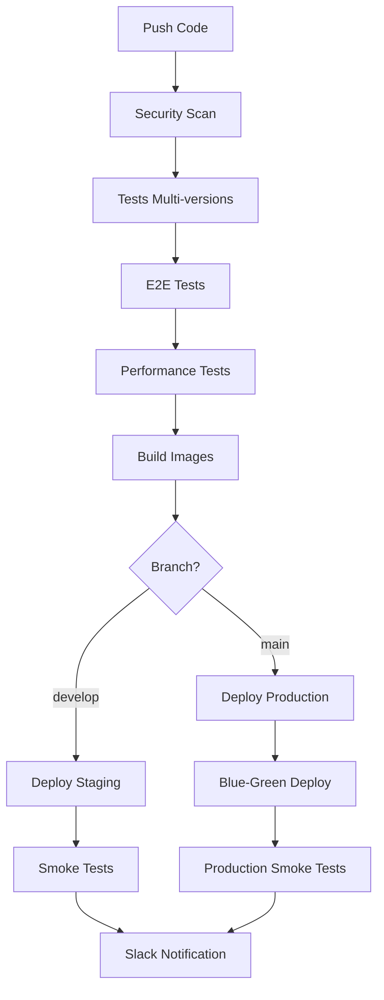

# 🚀 Pipeline CI/CD Amélioré - Résumé

## ✅ Améliorations Apportées

### 🔒 **Sécurité et Qualité**
- **Trivy** : Scan de vulnérabilités automatique
- **PHPStan** : Analyse statique PHP
- **ESLint** : Analyse JavaScript/React
- **SARIF Upload** : Intégration GitHub Security

### 🧪 **Tests Avancés**
- **Multi-versions** : PHP 8.1/8.2/8.3, Node 16/18/20
- **Couverture de code** : Codecov intégration
- **Tests E2E** : Playwright multi-navigateurs
- **Tests de performance** : K6 load testing

### 🚀 **Déploiement Intelligent**
- **Blue-Green Deployment** en production
- **Environnements séparés** : Staging + Production
- **Déploiement manuel** via workflow_dispatch
- **Smoke tests** post-déploiement

### 📊 **Monitoring et Notifications**
- **Slack notifications** automatiques
- **Rapports détaillés** de déploiement
- **Artefacts conservés** (logs, coverage, reports)
- **Métriques de performance** trackées

## 🎯 Workflows Disponibles

| Workflow | Déclencheur | Fonctionnalités |
|----------|-------------|-----------------|
| **enhanced-ci-cd.yml** | Push, PR, Manuel | Pipeline complet avec tous les tests |
| **ci-cd.yml** | Push, PR | Pipeline standard existant |
| **security-quality.yml** | Push | Analyse de sécurité uniquement |
| **deploy.yml** | Manuel | Déploiement multi-environnements |

## 🔧 Configuration Requise

### Secrets GitHub
```bash
DOCKER_USERNAME          # Docker Hub
DOCKER_PASSWORD          # Docker Hub
KUBE_CONFIG_STAGING      # Kubernetes Staging
KUBE_CONFIG_PRODUCTION   # Kubernetes Production
SLACK_WEBHOOK_URL        # Notifications Slack
```

### Commandes de Configuration
```bash
# Ajouter les secrets
gh secret set DOCKER_USERNAME --body "votre-username"
gh secret set KUBE_CONFIG_STAGING --body "$(cat ~/.kube/config | base64 -w 0)"
gh secret set SLACK_WEBHOOK_URL --body "https://hooks.slack.com/..."

# Déclencher un déploiement manuel
gh workflow run enhanced-ci-cd.yml -f deploy_environment=staging
```

## 📈 Métriques et Seuils

### Performance (K6)
- **95% des requêtes** < 500ms
- **Taux d'erreur** < 10%
- **Tests de charge** progressifs

### Couverture de Code
- **Backend** : Minimum 80%
- **Frontend** : Recommandé 70%

### Tests E2E
- **5 navigateurs** : Chrome, Firefox, Safari, Mobile
- **Retry automatique** : 2 fois
- **Screenshots** et vidéos en cas d'échec

## 🌊 Flux de Déploiement



## 🎉 Avantages du Nouveau Pipeline

### ⚡ **Performance**
- **Builds parallèles** multi-versions
- **Cache intelligent** Docker et npm
- **Artefacts réutilisables**

### 🛡️ **Fiabilité**
- **Tests complets** avant déploiement
- **Rollback automatique** en cas d'échec
- **Monitoring continu** des métriques

### 🔍 **Visibilité**
- **Rapports détaillés** de chaque étape
- **Notifications temps réel** Slack
- **Dashboards** de métriques

### 🚀 **Scalabilité**
- **Multi-environnements** (staging/prod)
- **Déploiement manuel** pour les hotfixes
- **Support multi-cloud** ready

## 🎯 Prochaines Étapes

1. **Configurer les secrets** GitHub
2. **Tester le pipeline** sur une feature branch
3. **Configurer Slack** pour les notifications
4. **Ajuster les seuils** selon vos besoins
5. **Former l'équipe** sur le nouveau workflow

## 🔗 Fichiers Créés/Modifiés

```
.github/
├── workflows/
│   └── enhanced-ci-cd.yml     # 🆕 Pipeline amélioré
├── DEPLOYMENT_GUIDE.md        # 🆕 Guide détaillé
docker-compose.test.yml        # 🆕 Environnement de test
e2e/
├── playwright.config.js       # 🆕 Config Playwright
├── package.json              # 🆕 Dépendances E2E
└── tests/
    └── auth.spec.js          # 🆕 Tests d'authentification
performance-tests/
└── load-test.js              # 🆕 Tests de charge K6
k8s/
├── prometheus-deployment.yaml # 🆕 Prometheus K8s
├── prometheus-service.yaml   # 🆕 Service Prometheus
├── grafana-deployment.yaml   # 🆕 Grafana K8s
├── grafana-service.yaml      # 🆕 Service Grafana
└── grafana-dashboards-configmap.yaml # 🆕 Dashboards
```

Le pipeline CI/CD est maintenant **considérablement amélioré** avec des fonctionnalités enterprise-grade ! 🎉
