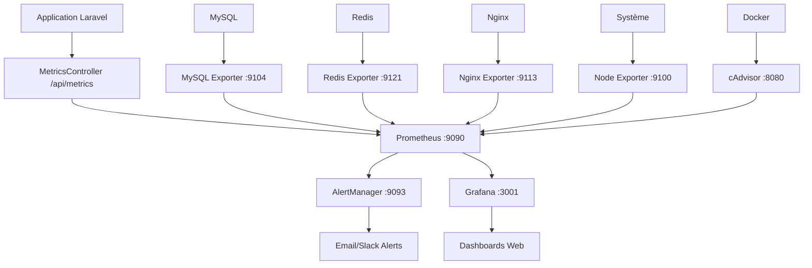

# 📊 Système de Monitoring Complet - Gestion Hospitalière

## 🎯 Vue d'Ensemble

Ce projet intègre un **système de monitoring professionnel** basé sur **Prometheus** et **Grafana** pour superviser votre application de gestion hospitalière en temps réel.

## 🚀 Démarrage Rapide

### Windows (PowerShell)
```powershell
# Démarrer le monitoring complet
.\scripts\start-monitoring.ps1

# Tester le système
.\scripts\test-monitoring.ps1 -Detailed
```

### Linux/Mac (Bash)
```bash
# Démarrer le monitoring
chmod +x scripts/start-monitoring.sh
./scripts/start-monitoring.sh

# Ou manuellement
docker-compose -f docker-compose.monitoring.yml up -d
```

## 🔗 Accès Rapide

| Service | URL | Identifiants | Description |
|---------|-----|--------------|-------------|
| **🏥 Application** | http://localhost:8000 | - | API Backend Laravel |
| **📊 Grafana** | http://localhost:3001 | admin/admin123 | Dashboards et visualisation |
| **🔍 Prometheus** | http://localhost:9090 | - | Métriques et requêtes |
| **🚨 AlertManager** | http://localhost:9093 | - | Gestion des alertes |

## 📈 Dashboards Disponibles

### 1. 🏥 **Hospital Management - Vue d'ensemble**
- **Patients actifs** en temps réel
- **Taux d'occupation des lits** par service
- **Rendez-vous du jour** et en attente
- **Performance de l'API** (temps de réponse, erreurs)

### 2. 🖥️ **Système & Infrastructure**
- **Usage CPU/Mémoire** par conteneur Docker
- **Trafic réseau** et I/O disque
- **Load average** et processus système
- **État des conteneurs** Docker

### 3. 🗄️ **Base de Données - MySQL & Redis**
- **Connexions MySQL** actives vs maximum
- **Performance des requêtes** SQL
- **Utilisation Redis** et hit rate cache
- **Taille des tables** et index

## 🚨 Alertes Configurées

### ❌ **Critiques** (Intervention Immédiate)
- Application backend indisponible
- Base de données MySQL down
- Taux d'erreur API > 5%
- Lits disponibles < 10%
- Espace disque < 10%

### ⚠️ **Warnings** (Surveillance Requise)
- Usage CPU > 80%
- Usage mémoire > 85%
- Temps de réponse > 2 secondes
- Charge patient > 500 patients
- RDV en attente > 100

## 📊 Métriques Personnalisées

### 🏥 **Métriques Métier**
```promql
# Taux d'occupation des lits
(hospital_total_beds - hospital_available_beds) / hospital_total_beds * 100

# Charge de travail quotidienne
hospital_appointments_today + hospital_patient_operations

# Efficacité du service
hospital_appointments_completed_today / hospital_appointments_today * 100
```

### 🔧 **Métriques Techniques**
```promql
# Performance API (P95)
histogram_quantile(0.95, rate(http_request_duration_seconds_bucket[5m]))

# Taux d'erreur
rate(http_requests_total{status=~"5.."}[5m]) / rate(http_requests_total[5m]) * 100

# Charge base de données
mysql_global_status_threads_connected / mysql_global_variables_max_connections * 100
```

## 🏗️ Architecture du Monitoring



## 📋 Structure des Fichiers

```
monitoring/
├── prometheus/
│   ├── prometheus.yml          # Configuration Prometheus
│   └── alert_rules.yml         # Règles d'alertes
├── grafana/
│   └── provisioning/
│       ├── datasources/        # Sources de données
│       └── dashboards/         # Dashboards JSON
├── alertmanager/
│   └── alertmanager.yml        # Configuration alertes
└── README.md                   # Guide du monitoring

scripts/
├── start-monitoring.ps1        # Démarrage Windows
├── start-monitoring.sh         # Démarrage Linux/Mac
└── test-monitoring.ps1         # Tests automatisés

docs/
├── MONITORING-SETUP.md         # Guide complet
└── CUSTOM-METRICS.md           # Métriques personnalisées
```

## 🛠️ Configuration

### Variables d'Environnement
Copiez `.env.monitoring` vers `.env.monitoring.local` et personnalisez :

```bash
# Grafana
GRAFANA_ADMIN_USER=admin
GRAFANA_ADMIN_PASSWORD=votre_mot_de_passe_securise

# Alertes
ALERT_EMAIL_TO=admin@votre-hopital.com
SLACK_WEBHOOK_URL=https://hooks.slack.com/...

# Seuils personnalisés
ALERT_CPU_THRESHOLD=80
ALERT_MEMORY_THRESHOLD=85
HOSPITAL_MAX_PATIENTS=500
```

### Personnalisation des Alertes
Éditez `monitoring/prometheus/alert_rules.yml` :

```yaml
- alert: CustomHospitalAlert
  expr: hospital_custom_metric > 100
  for: 5m
  labels:
    severity: warning
  annotations:
    summary: "Alerte personnalisée déclenchée"
    description: "La métrique {{ $labels.metric }} a atteint {{ $value }}"
```

## 🔧 Commandes Utiles

### Gestion des Services
```bash
# Démarrer le monitoring
docker-compose -f docker-compose.monitoring.yml up -d

# Voir les logs en temps réel
docker-compose -f docker-compose.monitoring.yml logs -f

# Redémarrer un service
docker-compose -f docker-compose.monitoring.yml restart grafana

# Arrêter le monitoring
docker-compose -f docker-compose.monitoring.yml down
```

### Tests et Diagnostics
```powershell
# Test complet du système
.\scripts\test-monitoring.ps1 -Detailed

# Générer de la charge pour tester
.\scripts\test-monitoring.ps1 -GenerateLoad

# Vérifier les métriques
curl http://localhost:8000/api/metrics
curl http://localhost:9090/api/v1/targets
```

### Sauvegarde et Restauration
```bash
# Sauvegarder les données
docker cp hospital_grafana:/var/lib/grafana ./backup/grafana-$(date +%Y%m%d)
docker cp hospital_prometheus:/prometheus ./backup/prometheus-$(date +%Y%m%d)

# Restaurer les données
docker cp ./backup/grafana-20231101 hospital_grafana:/var/lib/grafana
docker-compose -f docker-compose.monitoring.yml restart grafana
```

## 📊 Exemples de Requêtes PromQL

### Surveillance Opérationnelle
```promql
# Top 5 des services les plus chargés
topk(5, hospital_beds_by_service - hospital_available_beds_by_service)

# Évolution des patients sur 7 jours
increase(hospital_active_patients[7d])

# Prédiction de saturation des lits
predict_linear(hospital_available_beds[24h], 4*3600)
```

### Performance Technique
```promql
# Requêtes les plus lentes (P99)
histogram_quantile(0.99, rate(http_request_duration_seconds_bucket[5m]))

# Endpoints avec le plus d'erreurs
topk(5, rate(http_requests_total{status=~"5.."}[5m]))

# Charge par conteneur Docker
topk(5, rate(container_cpu_usage_seconds_total[5m]) * 100)
```

## 🎯 Cas d'Usage Métier

### 👨‍⚕️ **Pour le Personnel Médical**
- **Disponibilité des lits** par service en temps réel
- **Charge de travail** par médecin
- **Temps d'attente** des patients
- **Alertes** de surcharge

### 👔 **Pour la Direction**
- **Indicateurs de performance** globaux
- **Taux d'occupation** et rentabilité
- **Prévisions** de charge
- **Rapports** automatisés

### 💻 **Pour l'Équipe IT**
- **Performance** des serveurs et applications
- **Surveillance** proactive des pannes
- **Optimisation** des ressources
- **Sécurité** et conformité

## 🚨 Dépannage

### Problèmes Courants

**Grafana ne démarre pas**
```bash
# Vérifier les permissions
sudo chown -R 472:472 monitoring/grafana/data
docker-compose -f docker-compose.monitoring.yml restart grafana
```

**Métriques manquantes**
```bash
# Tester l'endpoint
curl http://localhost:8000/api/metrics

# Vérifier Prometheus
curl http://localhost:9090/api/v1/targets
```

**Alertes non reçues**
```bash
# Vérifier AlertManager
curl http://localhost:9093/api/v1/alerts

# Tester la configuration email
docker logs hospital_alertmanager
```

## 📈 Évolutions Futures

### Intégrations Prévues
- **📱 Application mobile** pour les alertes
- **🤖 Intelligence artificielle** pour la prédiction
- **📊 Rapports automatisés** par email
- **🔐 Authentification SSO** pour Grafana

### Métriques Avancées
- **Satisfaction patient** (enquêtes automatisées)
- **Efficacité énergétique** des équipements
- **Prédiction de pannes** matérielles
- **Optimisation des plannings** médicaux

## 📞 Support et Documentation

### Ressources Disponibles
- 📖 **Guide complet** : `docs/MONITORING-SETUP.md`
- 📊 **Métriques personnalisées** : `docs/CUSTOM-METRICS.md`
- 🔧 **Configuration** : `monitoring/README.md`
- 🧪 **Tests automatisés** : `scripts/test-monitoring.ps1`

### Aide et Support
1. **Consultez les logs** des services
2. **Testez la configuration** avec les scripts fournis
3. **Vérifiez la documentation** Prometheus/Grafana officielle
4. **Contactez l'équipe** DevOps pour les problèmes complexes

---

## 🎉 Félicitations !

Votre système de monitoring professionnel est maintenant opérationnel. Vous disposez d'une **surveillance complète** de votre application hospitalière avec :

- ✅ **Métriques métier** spécifiques à l'hôpital
- ✅ **Dashboards visuels** intuitifs
- ✅ **Alertes intelligentes** proactives
- ✅ **Performance monitoring** en temps réel
- ✅ **Documentation complète** et scripts d'automatisation

**🚀 Commencez dès maintenant avec `.\scripts\start-monitoring.ps1` !**
