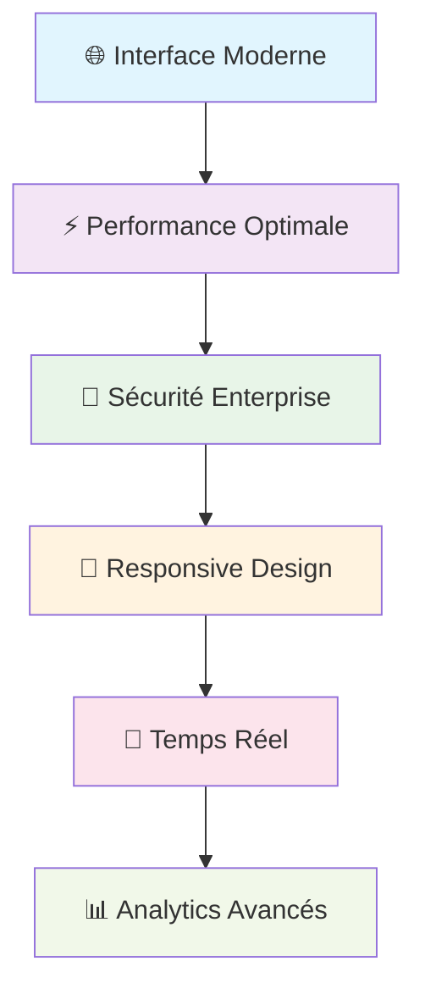

<div align="center">

# 🏥 **Gestion Hospitalière** 
### *Système de gestion hospitalière moderne et intelligent*

[](https://laravel.com)
[](https://reactjs.org)
[](https://www.docker.com)
[](LICENSE)

**🚀 Solution complète pour digitaliser votre hôpital**

[🎯 Test Rapide](#-test-rapide) • [📖 Documentation](#-documentation) • [🔧 Installation](#-installation-ultra-rapide)

---

</div>

## 🎯 **Pourquoi ce Projet ?**

> **Transformez votre hôpital** avec une solution moderne qui simplifie la gestion des patients, médecins et rendez-vous tout en offrant une sécurité de niveau entreprise.

<div align="center">

### 🏆 **Fonctionnalités Clés**

| 👥 **Patients** | 👨‍⚕️ **Médecins** | 📅 **Rendez-vous** | 📊 **Analytics** |
|:---:|:---:|:---:|:---:|
| Dossiers numériques | Gestion des spécialités | Calendrier intelligent | Dashboard temps réel |
| Upload documents | Planning optimisé | Notifications auto | Statistiques avancées |
| Historique complet | Suivi consultations | Gestion conflits | Rapports exportables |

</div>

---

## ✨ **Ce qui Rend ce Projet Unique**

<div align="center">



</div>

### 🛠️ **Stack Technologique**

<div align="center">

| **Backend** | **Frontend** | **Infrastructure** |
|:---:|:---:|:---:|
|  |  |  |
|  |  |  |
|  |  |  |

</div>

---

## 🚀 **Installation Ultra-Rapide**

<div align="center">

### ⚡ **3 Commandes, 5 Minutes, Prêt !**

</div>

```bash
# 1️⃣ Cloner et démarrer
git clone https://github.com/adamakonfe/gestion_hopital.git
cd gestion_hopital && docker-compose up -d

# 2️⃣ Configuration automatique
docker-compose exec backend composer install
docker-compose exec backend php artisan key:generate
docker-compose exec backend php artisan migrate --seed

# 3️⃣ C'est prêt ! 🎉
# 🌐 Frontend: http://localhost:3000
# 🔧 API: http://localhost:8000  
# 📧 MailHog: http://localhost:8025
```

<div align="center">

### 🎭 **Comptes de Test**

| Rôle | Email | Mot de passe | Accès |
|:---:|:---:|:---:|:---:|
| **👑 Admin** | `admin@hospital.com` | `password` | 🔓 Accès complet |
| **👨‍⚕️ Médecin** | `medecin@hospital.com` | `password` | 🏥 Gestion médicale |
| **👤 Patient** | `patient@hospital.com` | `password` | 📋 Profil personnel |

</div>

---

## 🎯 **Test Rapide**

<div align="center">

### 🔥 **Testez en 2 Minutes !**

</div>

1. **🔑 Connexion** → Utilisez `admin@hospital.com` / `password`
2. **👥 Créer un patient** → Menu "Patients" → "Nouveau Patient"  
3. **📅 Planifier un RDV** → Menu "Rendez-vous" → "Nouveau"
4. **📧 Vérifier les emails** → http://localhost:8025 (MailHog)
5. **📊 Voir les stats** → Dashboard avec graphiques temps réel

<div align="center">

**🎉 Félicitations ! Vous avez testé toutes les fonctionnalités principales !**

</div>

---

## 🏗️ **Architecture**

<div align="center">

```ascii
┌─────────────────────────────────────────┐
│        🌐 Frontend (React 19)           │
│     Interface Moderne + TailwindCSS     │
└─────────────────┬───────────────────────┘
                  │ 🔄 API REST (JSON)
┌─────────────────┴───────────────────────┐
│        ⚙️ Backend (Laravel 12)          │
│    API + Auth + Validation + Jobs       │
└─────────────────┬───────────────────────┘
                  │ 💾 Données
┌─────────────────┴───────────────────────┐
│     🗄️ MySQL 8.0 + Redis + Storage      │
│        Base de données + Cache          │
└─────────────────────────────────────────┘
```

</div>

---

## 🔐 **Sécurité & Performance**

<div align="center">

| 🛡️ **Sécurité** | ⚡ **Performance** |
|:---:|:---:|
| ✅ Authentification JWT | ✅ Cache Redis |
| ✅ Validation stricte | ✅ API < 500ms |
| ✅ Rate Limiting | ✅ Interface < 2s |
| ✅ Upload sécurisé | ✅ Monitoring temps réel |
| ✅ Protection XSS/CSRF | ✅ Optimisation automatique |

</div>

---

## 📊 **Monitoring & Analytics**

<div align="center">

### 📈 **Dashboards Intégrés**

| **Grafana** | **Prometheus** | **Application** |
|:---:|:---:|:---:|
| 📊 Métriques système | 📈 Collecte données | 🏥 Stats hospitalières |
| 🖥️ CPU, RAM, Réseau | ⏱️ Temps réponse | 👥 Patients, Médecins |
| 🔄 Temps réel | 📊 Historiques | 📅 Rendez-vous |

</div>

---

## 🛠️ **Dépannage Rapide**

<details>
<summary><strong>🚨 Problèmes Courants</strong></summary>

### Port occupé ?
```bash
docker-compose down && docker-compose up -d
```

### Base de données ?
```bash
docker-compose exec backend php artisan migrate:fresh --seed
```

### Emails non reçus ?
```bash
# Vérifiez MailHog: http://localhost:8025
```

### Erreur d'auth ?
```bash
docker-compose exec backend php artisan key:generate
```

</details>

---

## 📚 **Documentation**

<div align="center">

| 📖 **Guide** | 🔧 **Technique** | 🚀 **Déploiement** |
|:---:|:---:|:---:|
| [Guide Utilisateur](./GUIDE_UTILISATEUR.md) | [Architecture](./ARCHITECTURE.md) | [Docker](./GUIDE_DEPLOIEMENT.md) |
| [FAQ](./FAQ.md) | [API Documentation](./API.md) | [Kubernetes](./K8S_GUIDE.md) |
| [Changelog](./CHANGELOG.md) | [Tests](./TESTS.md) | [CI/CD](./CICD.md) |

</div>

---

## 🤝 **Contribution**

<div align="center">

**Nous accueillons toutes les contributions ! 🎉**

[🐛 Reporter un Bug](https://github.com/adamakonfe/gestion_hopital/issues) • [💡 Proposer une Fonctionnalité](https://github.com/adamakonfe/gestion_hopital/discussions) • [📖 Améliorer la Doc](https://github.com/adamakonfe/gestion_hopital/pulls)

</div>

---

## 📄 **Licence & Contact**

<div align="center">

**📄 Licence:** MIT - Libre d'utilisation  
**📧 Support:** support@hospital.com  
**💬 Discussions:** [GitHub Discussions](https://github.com/adamakonfe/gestion_hopital/discussions)

---

### 🌟 **Fait avec ❤️ pour révolutionner la gestion hospitalière**

**⭐ N'oubliez pas de mettre une étoile si ce projet vous aide !**

[](https://github.com/adamakonfe/gestion_hopital/stargazers)
[](https://github.com/adamakonfe/gestion_hopital/network)

</div>
