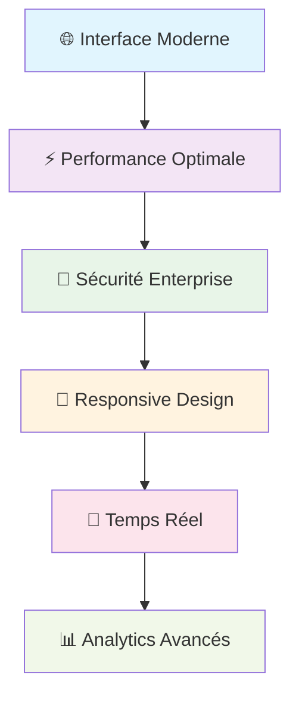
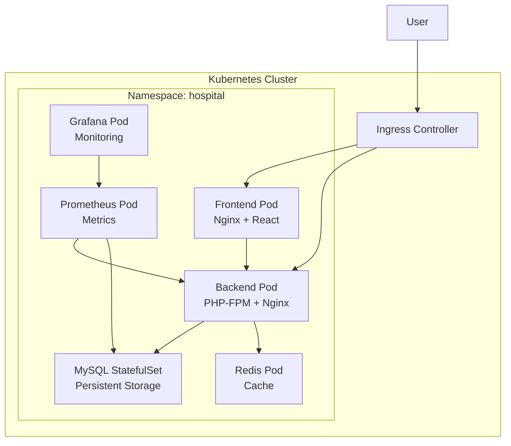

<div align="center">

# 🏥 **Gestion Hospitalière** 
### *Système de gestion hospitalière moderne et intelligent*

[](https://laravel.com)
[](https://reactjs.org)
[](https://www.docker.com)
[](LICENSE)

**🚀 Solution complète pour digitaliser votre hôpital**

[🎯 Test Rapide](#-test-rapide) • [📖 Documentation](#-documentation) • [🔧 Installation](#-installation-ultra-rapide)

---

</div>

## 🎯 **Pourquoi ce Projet ?**

> **Transformez votre hôpital** avec une solution moderne qui simplifie la gestion des patients, médecins et rendez-vous tout en offrant une sécurité de niveau entreprise.

<div align="center">

### 🏆 **Fonctionnalités Clés**

| 👥 **Patients** | 👨‍⚕️ **Médecins** | 📅 **Rendez-vous** | 📊 **Analytics** |
|:---:|:---:|:---:|:---:|
| Dossiers numériques | Gestion des spécialités | Calendrier intelligent | Dashboard temps réel |
| Upload documents | Planning optimisé | Notifications auto | Statistiques avancées |
| Historique complet | Suivi consultations | Gestion conflits | Rapports exportables |

</div>

---

## ✨ **Ce qui Rend ce Projet Unique**

<div align="center">



</div>

### 🛠️ **Stack Technologique**

<div align="center">

| **Backend** | **Frontend** | **Infrastructure** |
|:---:|:---:|:---:|
|  |  |  |
|  |  |  |
|  |  |  |

</div>

---

## 🚀 **Installation Ultra-Rapide**

<div align="center">

### ⚡ **3 Commandes, 5 Minutes, Prêt !**

</div>

```bash
# 1️⃣ Cloner et démarrer
git clone https://github.com/adamakonfe/gestion_hopital.git
cd gestion_hopital && docker-compose up -d

# 2️⃣ Configuration automatique
docker-compose exec backend composer install
docker-compose exec backend php artisan key:generate
docker-compose exec backend php artisan migrate --seed

# 3️⃣ C'est prêt ! 🎉
# 🌐 Frontend: http://localhost:3000
# 🔧 API: http://localhost:8000  
# 📧 MailHog: http://localhost:8025
```

---

## ☸️ **Déploiement Kubernetes (Production-Ready)**

### **⚠️ Notes Importantes**

> **Configuration Critique** : Le frontend utilise un proxy Nginx pour router `/api/*` vers le backend. La configuration utilise le FQDN complet `backend.hospital.svc.cluster.local` pour éviter les problèmes de résolution DNS.

> **Base de Données** : Après le déploiement, vous DEVEZ initialiser la base de données avec `php artisan migrate:fresh --seed --force` pour créer les utilisateurs avec des mots de passe hashés correctement.

> **Port-Forwarding** : Toujours tuer les processus `kubectl.exe` existants avant de relancer les port-forwards pour éviter les conflits de ports.

### **📋 Prérequis**
- **Minikube** installé et démarré
- **kubectl** configuré
- **Docker** pour construire les images
- **4GB RAM** minimum pour Minikube

### **🚀 Installation Complète**

```powershell
# 1️⃣ Démarrer Minikube avec configuration optimale
minikube start --driver=docker --memory=4096 --cpus=2 --disk-size=20g
minikube addons enable ingress
minikube addons enable metrics-server

# 2️⃣ Build et charger les images Docker
docker build -f Dockerfile.backend -t savlong/hospital-backend:latest .
docker build -f Dockerfile.frontend -t savlong/hospital-frontend:latest .

# Charger les images dans Minikube
minikube image load savlong/hospital-backend:latest
minikube image load savlong/hospital-frontend:latest

# Vérifier que les images sont chargées
minikube image ls | Select-String "hospital"

# 3️⃣ Déploiement ordonné (important pour les dépendances)
kubectl apply -f k8s/namespace.yaml
kubectl apply -f k8s/secrets.yaml
kubectl apply -f k8s/configmap-nginx-backend.yaml
kubectl apply -f k8s/configmap-nginx-frontend.yaml
kubectl apply -f k8s/mysql-statefulset.yaml
kubectl apply -f k8s/mysql-service.yaml
kubectl apply -f k8s/redis-deployment.yaml
kubectl apply -f k8s/redis-service.yaml

# Attendre que MySQL soit prêt
kubectl wait --for=condition=ready pod -l app=mysql -n hospital --timeout=300s

# Déployer les services applicatifs
kubectl apply -f k8s/backend-deployment.yaml
kubectl apply -f k8s/backend-service.yaml
kubectl apply -f k8s/frontend-deployment.yaml
kubectl apply -f k8s/frontend-service.yaml

# Déployer le monitoring
kubectl apply -f k8s/metrics-exporter-deployment.yaml
kubectl apply -f k8s/prometheus-deployment.yaml
kubectl apply -f k8s/prometheus-service.yaml

# Créer les dashboards Grafana depuis les fichiers JSON
kubectl create configmap grafana-dashboards --from-file=grafana/dashboards/ -n hospital

kubectl apply -f k8s/grafana-deployment.yaml
kubectl apply -f k8s/grafana-service.yaml

# Optionnel: Ingress pour accès par noms de domaine
kubectl apply -f k8s/ingress.yaml

# 4️⃣ Initialiser la base de données
kubectl wait --for=condition=ready pod -l app=backend -n hospital --timeout=120s
kubectl exec -n hospital deployment/backend -c php-fpm -- php artisan migrate:fresh --seed --force

# 5️⃣ Vérification du déploiement
kubectl get all -n hospital
kubectl get pods -n hospital

# 6️⃣ Configurer le port-forwarding
# IMPORTANT: Tuer les processus kubectl existants avant de relancer
taskkill /IM kubectl.exe /F 2>$null

# Lancer les port-forwards (dans des terminaux séparés ou en arrière-plan)
Start-Process powershell -ArgumentList "-NoExit", "-Command", "kubectl port-forward -n hospital service/frontend 3000:80"
Start-Process powershell -ArgumentList "-NoExit", "-Command", "kubectl port-forward -n hospital service/grafana 3001:3000"
Start-Process powershell -ArgumentList "-NoExit", "-Command", "kubectl port-forward -n hospital service/prometheus 9091:9090"

# Accès aux services:
# Frontend: http://localhost:3000
# Grafana: http://localhost:3001 (admin/admin123)
# Prometheus: http://localhost:9091
```

#### **🔍 Diagnostic et Vérification**

```powershell
# Vérifier l'état de tous les composants
kubectl get pods -n hospital
kubectl get services -n hospital
kubectl get pvc -n hospital  # Volumes persistants
kubectl get secrets -n hospital

# Vérifier les logs en cas de problème
kubectl logs -n hospital deployment/backend
kubectl logs -n hospital deployment/frontend
kubectl logs -n hospital deployment/grafana
kubectl logs -n hospital statefulset/mysql

# Vérifier la connectivité réseau
kubectl exec -n hospital deployment/backend -- curl -s http://mysql:3306 || echo "MySQL non accessible"
kubectl exec -n hospital deployment/backend -- curl -s http://redis:6379 || echo "Redis non accessible"
```

#### **🌐 Méthodes d'Accès**

##### **Option A: Port-Forward (Développement)**
```powershell
# Libérer tous les ports existants
taskkill /IM kubectl.exe /F 2>$null

# Port-forward avec ports optimaux (terminaux séparés)
kubectl port-forward -n hospital service/frontend 3000:80     # Terminal 1
kubectl port-forward -n hospital service/backend 8001:80      # Terminal 2
kubectl port-forward -n hospital service/grafana 3001:3000    # Terminal 3
kubectl port-forward -n hospital service/prometheus 9091:9090 # Terminal 4

# Accès via :
# Frontend: http://localhost:3000 (même port que Docker !)
# Backend API: http://localhost:8001
# Grafana: http://localhost:3001 (admin/admin123)
# Prometheus: http://localhost:9091
```

##### **Option B: Ingress (Production-like)**
```powershell
# Obtenir l'IP de Minikube
$MINIKUBE_IP = minikube ip

# Ajouter au fichier hosts Windows (C:\Windows\System32\drivers\etc\hosts)
# Exécuter en tant qu'administrateur :
Add-Content -Path "C:\Windows\System32\drivers\etc\hosts" -Value "$MINIKUBE_IP app.local"
Add-Content -Path "C:\Windows\System32\drivers\etc\hosts" -Value "$MINIKUBE_IP api.local"

# Accès via noms de domaine :
# Frontend: http://app.local
# Backend API: http://api.local
# Grafana: http://app.local/grafana (si configuré)
```

##### **Option C: Minikube Service (Simple)**
```powershell
# Ouvrir automatiquement dans le navigateur
minikube service frontend -n hospital
minikube service grafana -n hospital
minikube service prometheus -n hospital
```

---

### **⚡ Commandes Rapides**

```powershell
# 🚀 Démarrage rapide (après installation initiale)
minikube start
kubectl port-forward -n hospital service/frontend 3000:80 &
kubectl port-forward -n hospital service/backend 8001:80 &
kubectl port-forward -n hospital service/grafana 3001:3000 &

# 🔄 Redémarrer tous les services
kubectl rollout restart deployment -n hospital

# 📊 Voir l'état de tous les pods
kubectl get pods -n hospital

# 🔍 Voir les logs en temps réel
kubectl logs -f -n hospital deployment/backend
kubectl logs -f -n hospital deployment/frontend

# 🗑️ Nettoyer et redémarrer
kubectl delete namespace hospital
kubectl apply -f k8s/

# 🛑 Arrêter Minikube
minikube stop
```

---

#### **🔧 Configuration Avancée**

##### **Initialisation de la Base de Données**
```powershell
# Se connecter au pod backend pour initialiser la DB
kubectl exec -n hospital deployment/backend -it -- bash

# Dans le pod backend :
php artisan migrate:fresh --seed
php artisan key:generate
php artisan config:cache
php artisan route:cache
exit
```

##### **🔐 Identifiants par Défaut**
```
Application Web:
- Email: admin@hospital.com
- Mot de passe: password

Grafana:
- Username: admin
- Password: admin123

MySQL (depuis le pod):
- User: root
- Password: password
- Database: hospital_db
```

##### **📊 Dashboards Grafana**
Grafana est pré-configuré avec **3 dashboards** :

1. **Hospital Application Metrics** ✅
   - Total Utilisateurs
   - Total Patients
   - Total Médecins
   
2. **Hospital Overview** ✅
   - Rendez-vous (total, par statut, aujourd'hui)
   - Prescriptions
   - Factures
   - Taux d'occupation des lits

3. **System Metrics** ✅
   - CPU Usage (%)
   - Memory Usage (%)
   - Memory Details
   - Network Traffic
   - System Uptime

##### **Monitoring et Métriques**
```powershell
# Vérifier que Prometheus collecte les métriques
kubectl port-forward -n hospital service/prometheus 9091:9090
# Aller sur http://localhost:9091/targets

# Métriques disponibles depuis le backend Laravel:
# - hospital_users_total
# - hospital_patients_total  
# - hospital_medecins_total
# - hospital_rendezvous_total
# - hospital_prescriptions_total
# - hospital_factures_total
# - hospital_lits_total
# - hospital_lits_occupes
# - hospital_database_up

# Métriques système depuis metrics-exporter:
# - hospital_cpu_usage
# - hospital_memory_usage
# - hospital_memory_total
# - hospital_memory_used
# - hospital_network_in
# - hospital_network_out
# - hospital_uptime
```

#### **🚨 Dépannage Avancé**

##### **🔴 Problème: Erreur 405 ou 502 lors de la connexion**
```powershell
# Cause: Le proxy Nginx du frontend ne fonctionne pas correctement
# Solution: Vérifier et recréer la configuration Nginx

# 1. Vérifier la configuration actuelle
kubectl exec -n hospital deployment/frontend -- cat /etc/nginx/conf.d/default.conf

# 2. Si le proxy_pass n'est pas présent, recréer le ConfigMap
kubectl delete configmap frontend-nginx-conf -n hospital
kubectl apply -f k8s/configmap-nginx-frontend.yaml

# 3. Redémarrer le frontend
kubectl delete pod -n hospital -l app=frontend
kubectl wait --for=condition=ready pod -l app=frontend -n hospital --timeout=60s

# 4. Tester le proxy
kubectl exec -n hospital deployment/frontend -- curl -s http://localhost/api/health
```

##### **🔴 Problème: Base de données vide ou mots de passe incorrects**
```powershell
# Réinitialiser complètement la base de données
kubectl exec -n hospital deployment/backend -c php-fpm -- php artisan migrate:fresh --seed --force

# Vérifier les logs si erreur
kubectl logs -n hospital deployment/backend -c php-fpm --tail=50
```

##### **🔴 Problème: Port-forward échoue (port déjà utilisé)**
```powershell
# Tuer tous les processus kubectl
taskkill /IM kubectl.exe /F

# Attendre 2 secondes puis relancer
Start-Sleep -Seconds 2
kubectl port-forward -n hospital service/frontend 3000:80
```

##### **Problèmes de Build d'Images**
```powershell
# Re-build forcé des images
docker build --no-cache -f Dockerfile.backend -t savlong/hospital-backend:latest .
docker build --no-cache -f Dockerfile.frontend -t savlong/hospital-frontend:latest .

# Charger dans Minikube
minikube image load savlong/hospital-backend:latest
minikube image load savlong/hospital-frontend:latest

# Vérifier
minikube image ls | Select-String "hospital"
```

##### **Problèmes de Pods**
```powershell
# Pod en erreur ImagePullBackOff
kubectl describe pod -n hospital <pod-name>

# Redémarrer un déploiement
kubectl rollout restart deployment/backend -n hospital
kubectl rollout restart deployment/frontend -n hospital

# Forcer la suppression d'un pod bloqué
kubectl delete pod -n hospital <pod-name> --force --grace-period=0
```

##### **Problèmes de Réseau**
```powershell
# Tester la connectivité entre services
kubectl exec -n hospital deployment/frontend -- nslookup backend
kubectl exec -n hospital deployment/backend -- nslookup mysql

# Vérifier les endpoints
kubectl get endpoints -n hospital
```

##### **Problèmes de Stockage**
```powershell
# Vérifier les volumes persistants
kubectl get pv
kubectl get pvc -n hospital

# Nettoyer les volumes (ATTENTION : perte de données)
kubectl delete pvc mysql-data-mysql-0 -n hospital
```

#### **🔄 Mise à Jour et Maintenance**

```powershell
# Mise à jour des images
docker build -f Dockerfile.backend -t gestion-hopital-backend:v2 .
kubectl set image deployment/backend php-fpm=gestion-hopital-backend:v2 -n hospital

# Sauvegarde de la base de données
kubectl exec -n hospital statefulset/mysql -- mysqldump -u root -p hospital_db > backup.sql

# Nettoyage complet
kubectl delete namespace hospital
minikube delete  # Supprime tout le cluster
```

#### **📊 Architecture Kubernetes**



<div align="center">

### 🎭 **Comptes de Test**

| Rôle | Email | Mot de passe | Accès |
|:---:|:---:|:---:|:---:|
| **👑 Admin** | `admin@hospital.com` | `password` | 🔓 Accès complet |
| **👨‍⚕️ Médecin** | `medecin@hospital.com` | `password` | 🏥 Gestion médicale |
| **👤 Patient** | `patient@hospital.com` | `password` | 📋 Profil personnel |

</div>

---

## 🎯 **Test Rapide**

<div align="center">

### 🔥 **Testez en 2 Minutes !**

</div>

**🐳 Avec Docker :**
1. **🔑 Connexion** → http://localhost:3000 avec `admin@hospital.com` / `password`
2. **👥 Créer un patient** → Menu "Patients" → "Nouveau Patient"  
3. **📅 Planifier un RDV** → Menu "Rendez-vous" → "Nouveau"
4. **📧 Vérifier les emails** → http://localhost:8025 (MailHog)
5. **📊 Voir les stats** → Dashboard avec graphiques temps réel
6. **📈 Monitoring** → http://localhost:3001 (`admin`/`admin`) pour Grafana

**☸️ Avec Kubernetes :**
1. **🔑 Connexion** → http://localhost:3000 avec `admin@hospital.com` / `password`
2. **👥 Créer un patient** → Menu "Patients" → "Nouveau Patient"  
3. **📅 Planifier un RDV** → Menu "Rendez-vous" → "Nouveau"
4. **📧 Vérifier les emails** → http://localhost:8025 (MailHog via Docker Compose)
5. **📊 Voir les stats** → Dashboard avec graphiques temps réel
6. **📈 Monitoring** → http://localhost:3001 (`admin`/`admin123`) pour Grafana

<div align="center">

**🎉 Félicitations ! Vous avez testé toutes les fonctionnalités principales !**

### 🔄 **Expérience Unifiée Docker ↔ Kubernetes**

Grâce aux ports alignés, vous pouvez **basculer facilement** entre les deux environnements :

```powershell
# Passer de Docker à Kubernetes
docker-compose down                    # Arrêter Docker
kubectl port-forward -n hospital service/frontend 3000:80  # Même URL !

# Passer de Kubernetes à Docker  
taskkill /IM kubectl.exe /F           # Arrêter port-forwards
docker-compose up -d                  # Même URL !
```

**URLs identiques** : http://localhost:3000 dans les deux cas ! 🎯

</div>

---

## 🏗️ **Architecture**

<div align="center">

```ascii
┌─────────────────────────────────────────┐
│        🌐 Frontend (React 19)           │
│     Interface Moderne + TailwindCSS     │
└─────────────────┬───────────────────────┘
                  │ 🔄 API REST (JSON)
┌─────────────────┴───────────────────────┐
│        ⚙️ Backend (Laravel 12)          │
│    API + Auth + Validation + Jobs       │
└─────────────────┬───────────────────────┘
                  │ 💾 Données
┌─────────────────┴───────────────────────┐
│     🗄️ MySQL 8.0 + Redis + Storage      │
│        Base de données + Cache          │
└─────────────────────────────────────────┘
```

</div>

---

## 🔐 **Sécurité & Performance**

<div align="center">

| 🛡️ **Sécurité** | ⚡ **Performance** |
|:---:|:---:|
| ✅ Authentification JWT | ✅ Cache Redis |
| ✅ Validation stricte | ✅ API < 500ms |
| ✅ Rate Limiting | ✅ Interface < 2s |
| ✅ Upload sécurisé | ✅ Monitoring temps réel |
| ✅ Protection XSS/CSRF | ✅ Optimisation automatique |

</div>

---

## 📊 **Monitoring & Analytics**

### 🚀 **Accès aux Dashboards**

#### 🐳 **Avec Docker Compose**

<div align="center">

| Service | URL | Identifiants | Description |
|:---:|:---:|:---:|:---:|
| **🏥 Application** | http://localhost:3000 | Voir comptes de test | Interface principale |
| **🔧 Backend API** | http://localhost:8000 | Token JWT requis | API REST |
| **📊 Grafana** | http://localhost:3001 | `admin` / `admin` | Dashboards & métriques |
| **📈 Prometheus** | http://localhost:9090 | Aucun | Collecte de données |
| **📧 MailHog** | http://localhost:8025 | Aucun | Emails de test |

</div>

#### ☸️ **Avec Kubernetes (Port-Forward)**

<div align="center">

| Service | URL | Identifiants | Description |
|:---:|:---:|:---:|:---:|
| **🏥 Application** | http://localhost:3000 | Voir comptes de test | Interface principale |
| **🔧 Backend API** | http://localhost:8001 | Token JWT requis | API REST |
| **📊 Grafana** | http://localhost:3001 | `admin` / `admin123` | Dashboards & métriques |
| **📈 Prometheus** | http://localhost:9091 | Aucun | Collecte de données |
| **📧 MailHog** | http://localhost:8025 | Aucun | Emails via Docker Compose |

</div>

> **💡 Note :** Ports Kubernetes alignés avec Docker Compose (3000, 3001) après suppression de Grafana Windows. Configuration identique pour une expérience unifiée.

### 📈 **Configuration Grafana**

#### 1. **Premier Accès**
```bash
# Démarrer tous les services
docker-compose up -d

# Attendre que Grafana soit prêt (2-3 minutes)
docker-compose logs -f grafana

# Accéder à Grafana
# URL: http://localhost:3001
# Login: admin / admin
```

#### 2. **Dashboards Disponibles**

**🖥️ System Metrics Dashboard**
- **CPU Usage** : Utilisation processeur en temps réel
- **Memory Usage** : Consommation RAM
- **Network Traffic** : Trafic réseau entrant/sortant
- **Disk I/O** : Lecture/écriture disque
- **System Uptime** : Temps de fonctionnement

**🏥 Hospital Application Dashboard**
- **👥 Total Utilisateurs** : Compteur temps réel
- **🏥 Total Patients** : Nombre de patients enregistrés
- **👨‍⚕️ Total Médecins** : Nombre de médecins actifs
- **📅 Rendez-vous Aujourd'hui** : RDV du jour par statut
- **📊 Rendez-vous par Statut** : Répartition (Confirmé, En attente, Terminé)
- **🗄️ Database Status** : État de la connexion MySQL

#### 3. **Configuration des Alertes**
```bash
# Accéder aux alertes Grafana
# Grafana → Alerting → Alert Rules

# Exemples d'alertes configurées :
# - CPU > 80% pendant 5 minutes
# - Mémoire > 90% pendant 2 minutes  
# - Base de données inaccessible
# - Temps de réponse API > 1 seconde
```

### 📈 **Configuration Prometheus**

#### 1. **Accès Prometheus**
```bash
# URL: http://localhost:9090
# Interface de requêtes et métriques brutes
```

#### 2. **Métriques Disponibles**
```promql
# Métriques système
node_cpu_seconds_total
node_memory_MemAvailable_bytes
node_network_receive_bytes_total

# Métriques application
hospital_users_total
hospital_patients_total
hospital_medecins_total
hospital_appointments_total
hospital_appointments_by_status{status="confirmed"}
hospital_database_up
```

#### 3. **Requêtes Utiles**
```promql
# Nombre total d'utilisateurs
hospital_users_total

# Rendez-vous par statut
sum by (status) (hospital_appointments_by_status)

# Utilisation CPU moyenne
avg(rate(node_cpu_seconds_total[5m])) * 100

# Mémoire disponible en %
(node_memory_MemAvailable_bytes / node_memory_MemTotal_bytes) * 100
```

### 🔧 **Configuration Avancée**

#### Personnaliser les Dashboards
```bash
# 1. Accéder à Grafana (http://localhost:3001)
# 2. Aller dans "+" → "Import"
# 3. Utiliser les IDs de dashboards communautaires :
#    - Node Exporter: 1860
#    - MySQL Overview: 7362
#    - Docker Monitoring: 893

# Ou créer un dashboard personnalisé :
# 1. "+" → "Dashboard" → "Add Panel"
# 2. Configurer la requête Prometheus
# 3. Personnaliser la visualisation
```

#### Ajouter des Métriques Custom
```php
// Dans votre code Laravel (backend)
// Exemple: app/Http/Middleware/PrometheusMetrics.php

use Prometheus\CollectorRegistry;
use Prometheus\Counter;

$registry = app(CollectorRegistry::class);
$counter = $registry->getOrRegisterCounter(
    'hospital',
    'login_attempts_total',
    'Total login attempts',
    ['status']
);

$counter->incBy(1, ['success']);
```

### 🚨 **Dépannage Monitoring**

#### Grafana ne charge pas
```bash
# Vérifier les logs
docker-compose logs grafana

# Redémarrer Grafana
docker-compose restart grafana

# Vérifier les ports
netstat -an | findstr "3001"
```

#### Prometheus sans données
```bash
# Vérifier la configuration
docker-compose exec prometheus cat /etc/prometheus/prometheus.yml

# Vérifier les targets
# Aller sur http://localhost:9090/targets

# Redémarrer Prometheus
docker-compose restart prometheus
```

#### Métriques manquantes
```bash
# Vérifier que l'application expose les métriques
curl http://localhost:8000/metrics

# Vérifier la configuration Prometheus
docker-compose logs prometheus
```

### 📊 **Dashboards de Production**

Pour un environnement de production, configurez :

1. **Alertes Email/Slack** : Notifications automatiques
2. **Retention des données** : Conservation long terme
3. **Haute disponibilité** : Clustering Grafana/Prometheus
4. **Sécurité** : Authentification LDAP/OAuth
5. **Backup** : Sauvegarde des dashboards

```bash
# Exemple de configuration production
# Voir: ./grafana/provisioning/ et ./prometheus/
```

---

## 🛠️ **Dépannage Rapide**

<details>
<summary><strong>🚨 Problèmes Courants</strong></summary>

### Port occupé ?
```bash
docker-compose down && docker-compose up -d
```

### Base de données ?
```bash
docker-compose exec backend php artisan migrate:fresh --seed
```

### Emails non reçus ?
```bash
# Vérifiez MailHog: http://localhost:8025
```

### Erreur d'auth ?
```bash
docker-compose exec backend php artisan key:generate
```

### ☸️ Problèmes Kubernetes

#### Port-forward échoue (Windows)
```powershell
# Libérer tous les ports kubectl
taskkill /IM kubectl.exe /F 2>$null

# Utiliser les ports optimaux (alignés avec Docker Compose)
kubectl port-forward -n hospital service/frontend 3000:80     # Terminal 1
kubectl port-forward -n hospital service/backend 8001:80      # Terminal 2
kubectl port-forward -n hospital service/grafana 3001:3000    # Terminal 3
kubectl port-forward -n hospital service/prometheus 9091:9090 # Terminal 4

# Si problème persiste, redémarrer services réseau (admin requis)
net stop winnat && net start winnat
```

#### Images non trouvées (ImagePullBackOff)
```powershell
# CRITIQUE: Vérifier le contexte Docker Minikube
& minikube -p minikube docker-env --shell powershell | Invoke-Expression

# Vérifier que les images existent dans Minikube
docker images | findstr gestion-hopital

# Si images absentes, les re-builder dans le contexte Minikube
docker build --no-cache -f Dockerfile.backend -t gestion-hopital-backend:latest .
docker build --no-cache -f Dockerfile.frontend -t gestion-hopital-frontend:latest .

# Forcer le redéploiement
kubectl rollout restart deployment/backend -n hospital
kubectl rollout restart deployment/frontend -n hospital
```

#### Base de données non initialisée
```powershell
# Vérifier que MySQL est prêt
kubectl get pods -n hospital -l app=mysql

# Initialiser la base de données
kubectl exec -n hospital deployment/backend -it -- php artisan migrate:fresh --seed

# Si erreur de connexion MySQL
kubectl logs -n hospital statefulset/mysql
kubectl describe pod -n hospital -l app=mysql
```

#### Grafana sans dashboards
```powershell
# Vérifier la configuration Grafana
kubectl logs -n hospital deployment/grafana

# Redémarrer Grafana pour recharger les dashboards
kubectl rollout restart deployment/grafana -n hospital

# Vérifier que Prometheus est accessible
kubectl exec -n hospital deployment/grafana -- curl -s http://prometheus:9090/api/v1/query?query=up
```

#### Pods en CrashLoopBackOff
```powershell
# Diagnostiquer le problème
kubectl describe pod -n hospital <pod-name>
kubectl logs -n hospital <pod-name> --previous

# Problèmes courants et solutions :
# 1. Backend: Vérifier les secrets et variables d'environnement
kubectl get secrets -n hospital
kubectl describe secret hospital-secrets -n hospital

# 2. Frontend: Vérifier la configuration Nginx
kubectl logs -n hospital deployment/frontend

# 3. MySQL: Vérifier les volumes persistants
kubectl get pvc -n hospital
```

#### Connectivité réseau entre services
```powershell
# Tester la résolution DNS
kubectl exec -n hospital deployment/frontend -- nslookup backend
kubectl exec -n hospital deployment/backend -- nslookup mysql

# Tester la connectivité TCP
kubectl exec -n hospital deployment/backend -- nc -zv mysql 3306
kubectl exec -n hospital deployment/backend -- nc -zv redis 6379

# Vérifier les services et endpoints
kubectl get services -n hospital
kubectl get endpoints -n hospital
```

#### Réinitialisation complète
```powershell
# Nettoyage complet du namespace
kubectl delete namespace hospital

# Attendre la suppression complète
kubectl get namespaces

# Redéployer depuis le début
kubectl apply -f k8s/namespace.yaml
# ... puis suivre la procédure de déploiement complète
```

</details>

---

## ❓ **FAQ - Questions Fréquentes**

### **Q: Pourquoi j'obtiens une erreur 405 ou 502 lors de la connexion ?**
**R:** Le proxy Nginx du frontend n'est pas correctement configuré. Suivez ces étapes :
1. Vérifiez que le ConfigMap `frontend-nginx-conf` contient bien le `proxy_pass`
2. Recréez le ConfigMap : `kubectl delete configmap frontend-nginx-conf -n hospital && kubectl apply -f k8s/configmap-nginx-frontend.yaml`
3. Redémarrez le frontend : `kubectl delete pod -n hospital -l app=frontend`

### **Q: Le login échoue avec "This password does not use the Bcrypt algorithm" ?**
**R:** La base de données n'a pas été initialisée correctement. Exécutez :
```powershell
kubectl exec -n hospital deployment/backend -c php-fpm -- php artisan migrate:fresh --seed --force
```

### **Q: Le port-forward échoue avec "port already in use" ?**
**R:** Un processus kubectl est déjà en cours. Tuez-le avec :
```powershell
taskkill /IM kubectl.exe /F
Start-Sleep -Seconds 2
kubectl port-forward -n hospital service/frontend 3000:80
```

### **Q: Les dashboards Grafana affichent "No data" ?**
**R:** Attendez 30 secondes que Prometheus collecte les premières métriques, puis rafraîchissez la page. Si le problème persiste, vérifiez que le backend et le metrics-exporter sont en cours d'exécution.

### **Q: Comment accéder à l'application après le déploiement ?**
**R:** Utilisez le port-forwarding :
- Frontend : `http://localhost:3000` (admin@hospital.com / password)
- Grafana : `http://localhost:3001` (admin / admin123)
- Prometheus : `http://localhost:9091`

### **Q: Les images Docker ne se mettent pas à jour dans Minikube ?**
**R:** Utilisez `imagePullPolicy: Never` dans les déploiements et rechargez l'image :
```powershell
minikube image load savlong/hospital-backend:latest
kubectl delete pod -n hospital -l app=backend
```

---

## 📚 **Documentation**

<div align="center">

| 📖 **Guide** | 🔧 **Technique** | 🚀 **Déploiement** |
|:---:|:---:|:---:|
| [Guide Utilisateur](./GUIDE_UTILISATEUR.md) | [Architecture](./ARCHITECTURE.md) | [Docker](./GUIDE_DEPLOIEMENT.md) |
| [FAQ](./FAQ.md) | [API Documentation](./API.md) | [Kubernetes](./K8S_GUIDE.md) |
| [Changelog](./CHANGELOG.md) | [Tests](./TESTS.md) | [CI/CD](./CICD.md) |

</div>

---

## 🤝 **Contribution**

<div align="center">

**Nous accueillons toutes les contributions ! 🎉**

[🐛 Reporter un Bug](https://github.com/adamakonfe/gestion_hopital/issues) • [💡 Proposer une Fonctionnalité](https://github.com/adamakonfe/gestion_hopital/discussions) • [📖 Améliorer la Doc](https://github.com/adamakonfe/gestion_hopital/pulls)

</div>

---

## 📄 **Licence & Contact**

<div align="center">

**📄 Licence:** MIT - Libre d'utilisation  
**📧 Support:** support@hospital.com  
**💬 Discussions:** [GitHub Discussions](https://github.com/adamakonfe/gestion_hopital/discussions)

---

### 🌟 **Fait avec ❤️ pour révolutionner la gestion hospitalière**

**⭐ N'oubliez pas de mettre une étoile si ce projet vous aide !**

[](https://github.com/adamakonfe/gestion_hopital/stargazers)
[](https://github.com/adamakonfe/gestion_hopital/network)

</div>
