<div align="center">

# 🏥 **Gestion Hospitalière** 
### *Système de gestion hospitalière moderne et intelligent*

[](https://laravel.com)
[](https://reactjs.org)
[](https://www.docker.com)
[](LICENSE)

**🚀 Solution complète pour digitaliser votre hôpital**

[🎯 Test Rapide](#-test-rapide) • [📖 Documentation](#-documentation) • [🔧 Installation](#-installation-ultra-rapide)

---

</div>

## 🎯 **Pourquoi ce Projet ?**

> **Transformez votre hôpital** avec une solution moderne qui simplifie la gestion des patients, médecins et rendez-vous tout en offrant une sécurité de niveau entreprise.

<div align="center">

### 🏆 **Fonctionnalités Clés**

| 👥 **Patients** | 👨‍⚕️ **Médecins** | 📅 **Rendez-vous** | 📊 **Analytics** |
|:---:|:---:|:---:|:---:|
| Dossiers numériques | Gestion des spécialités | Calendrier intelligent | Dashboard temps réel |
| Upload documents | Planning optimisé | Notifications auto | Statistiques avancées |
| Historique complet | Suivi consultations | Gestion conflits | Rapports exportables |

</div>

---

## ✨ **Ce qui Rend ce Projet Unique**

```mermaid
graph TB
    A[🌐 Interface Moderne] --> B[⚡ Performance Optimale]
    B --> C[🔐 Sécurité Enterprise]
    C --> D[📱 Responsive Design]
    D --> E[🔄 Temps Réel]
    E --> F[📊 Analytics Avancés]
    
    style A fill:#e1f5fe
    style B fill:#f3e5f5
    style C fill:#e8f5e8
    style D fill:#fff3e0
    style E fill:#fce4ec
    style F fill:#f1f8e9
```

<div align="center">



</div>

### 🛠️ **Stack Technologique**

<div align="center">

| **Backend** | **Frontend** | **Infrastructure** |
|:---:|:---:|:---:|
|  |  |  |
|  |  |  |
|  |  |  |

</div>

---

## 🚀 **Installation Ultra-Rapide**

<div align="center">

### ⚡ **3 Commandes, 5 Minutes, Prêt !**

</div>

```bash
# 1️⃣ Cloner et démarrer
git clone https://github.com/adamakonfe/gestion_hopital.git
cd gestion_hopital && docker-compose up -d

# 2️⃣ Configuration automatique
docker-compose exec backend composer install
docker-compose exec backend php artisan key:generate
docker-compose exec backend php artisan migrate --seed

# 3️⃣ C'est prêt ! 🎉
# 🌐 Frontend: http://localhost:3000
# 🔧 API: http://localhost:8000  
# 📧 MailHog: http://localhost:8025
```

<div align="center">

### 🎭 **Comptes de Test**

| Rôle | Email | Mot de passe | Accès |
|:---:|:---:|:---:|:---:|
| **👑 Admin** | `admin@hospital.com` | `password` | 🔓 Accès complet |
| **👨‍⚕️ Médecin** | `medecin@hospital.com` | `password` | 🏥 Gestion médicale |
| **👤 Patient** | `patient@hospital.com` | `password` | 📋 Profil personnel |

</div>

---

## 🎯 **Test Rapide**

<div align="center">

### 🔥 **Testez en 2 Minutes !**

</div>

1. **🔑 Connexion** → Utilisez `admin@hospital.com` / `password`
2. **👥 Créer un patient** → Menu "Patients" → "Nouveau Patient"  
3. **📅 Planifier un RDV** → Menu "Rendez-vous" → "Nouveau"
4. **📧 Vérifier les emails** → http://localhost:8025 (MailHog)
5. **📊 Voir les stats** → Dashboard avec graphiques temps réel
6. **📈 Monitoring** → http://localhost:3001 (`admin`/`admin`) pour Grafana

<div align="center">

**🎉 Félicitations ! Vous avez testé toutes les fonctionnalités principales !**

</div>

---

## 🏗️ **Architecture**

<div align="center">

```ascii
┌─────────────────────────────────────────┐
│        🌐 Frontend (React 19)           │
│     Interface Moderne + TailwindCSS     │
└─────────────────┬───────────────────────┘
                  │ 🔄 API REST (JSON)
┌─────────────────┴───────────────────────┐
│        ⚙️ Backend (Laravel 12)          │
│    API + Auth + Validation + Jobs       │
└─────────────────┬───────────────────────┘
                  │ 💾 Données
┌─────────────────┴───────────────────────┐
│     🗄️ MySQL 8.0 + Redis + Storage      │
│        Base de données + Cache          │
└─────────────────────────────────────────┘
```

</div>

---

## 🔐 **Sécurité & Performance**

<div align="center">

| 🛡️ **Sécurité** | ⚡ **Performance** |
|:---:|:---:|
| ✅ Authentification JWT | ✅ Cache Redis |
| ✅ Validation stricte | ✅ API < 500ms |
| ✅ Rate Limiting | ✅ Interface < 2s |
| ✅ Upload sécurisé | ✅ Monitoring temps réel |
| ✅ Protection XSS/CSRF | ✅ Optimisation automatique |

</div>

---

## 📊 **Monitoring & Analytics**

### 🚀 **Accès aux Dashboards**

<div align="center">

| Service | URL | Identifiants | Description |
|:---:|:---:|:---:|:---:|
| **🏥 Application** | http://localhost:3000 | Voir comptes de test | Interface principale |
| **📊 Grafana** | http://localhost:3001 | `admin` / `admin` | Dashboards & métriques |
| **📈 Prometheus** | http://localhost:9090 | Aucun | Collecte de données |
| **📧 MailHog** | http://localhost:8025 | Aucun | Emails de test |

</div>

### 📈 **Configuration Grafana**

#### 1. **Premier Accès**
```bash
# Démarrer tous les services
docker-compose up -d

# Attendre que Grafana soit prêt (2-3 minutes)
docker-compose logs -f grafana

# Accéder à Grafana
# URL: http://localhost:3001
# Login: admin / admin
```

#### 2. **Dashboards Disponibles**

**🖥️ System Metrics Dashboard**
- **CPU Usage** : Utilisation processeur en temps réel
- **Memory Usage** : Consommation RAM
- **Network Traffic** : Trafic réseau entrant/sortant
- **Disk I/O** : Lecture/écriture disque
- **System Uptime** : Temps de fonctionnement

**🏥 Hospital Application Dashboard**
- **👥 Total Utilisateurs** : Compteur temps réel
- **🏥 Total Patients** : Nombre de patients enregistrés
- **👨‍⚕️ Total Médecins** : Nombre de médecins actifs
- **📅 Rendez-vous Aujourd'hui** : RDV du jour par statut
- **📊 Rendez-vous par Statut** : Répartition (Confirmé, En attente, Terminé)
- **🗄️ Database Status** : État de la connexion MySQL

#### 3. **Configuration des Alertes**
```bash
# Accéder aux alertes Grafana
# Grafana → Alerting → Alert Rules

# Exemples d'alertes configurées :
# - CPU > 80% pendant 5 minutes
# - Mémoire > 90% pendant 2 minutes  
# - Base de données inaccessible
# - Temps de réponse API > 1 seconde
```

### 📈 **Configuration Prometheus**

#### 1. **Accès Prometheus**
```bash
# URL: http://localhost:9090
# Interface de requêtes et métriques brutes
```

#### 2. **Métriques Disponibles**
```promql
# Métriques système
node_cpu_seconds_total
node_memory_MemAvailable_bytes
node_network_receive_bytes_total

# Métriques application
hospital_users_total
hospital_patients_total
hospital_medecins_total
hospital_appointments_total
hospital_appointments_by_status{status="confirmed"}
hospital_database_up
```

#### 3. **Requêtes Utiles**
```promql
# Nombre total d'utilisateurs
hospital_users_total

# Rendez-vous par statut
sum by (status) (hospital_appointments_by_status)

# Utilisation CPU moyenne
avg(rate(node_cpu_seconds_total[5m])) * 100

# Mémoire disponible en %
(node_memory_MemAvailable_bytes / node_memory_MemTotal_bytes) * 100
```

### 🔧 **Configuration Avancée**

#### Personnaliser les Dashboards
```bash
# 1. Accéder à Grafana (http://localhost:3001)
# 2. Aller dans "+" → "Import"
# 3. Utiliser les IDs de dashboards communautaires :
#    - Node Exporter: 1860
#    - MySQL Overview: 7362
#    - Docker Monitoring: 893

# Ou créer un dashboard personnalisé :
# 1. "+" → "Dashboard" → "Add Panel"
# 2. Configurer la requête Prometheus
# 3. Personnaliser la visualisation
```

#### Ajouter des Métriques Custom
```php
// Dans votre code Laravel (backend)
// Exemple: app/Http/Middleware/PrometheusMetrics.php

use Prometheus\CollectorRegistry;
use Prometheus\Counter;

$registry = app(CollectorRegistry::class);
$counter = $registry->getOrRegisterCounter(
    'hospital',
    'login_attempts_total',
    'Total login attempts',
    ['status']
);

$counter->incBy(1, ['success']);
```

### 🚨 **Dépannage Monitoring**

#### Grafana ne charge pas
```bash
# Vérifier les logs
docker-compose logs grafana

# Redémarrer Grafana
docker-compose restart grafana

# Vérifier les ports
netstat -an | findstr "3001"
```

#### Prometheus sans données
```bash
# Vérifier la configuration
docker-compose exec prometheus cat /etc/prometheus/prometheus.yml

# Vérifier les targets
# Aller sur http://localhost:9090/targets

# Redémarrer Prometheus
docker-compose restart prometheus
```

#### Métriques manquantes
```bash
# Vérifier que l'application expose les métriques
curl http://localhost:8000/metrics

# Vérifier la configuration Prometheus
docker-compose logs prometheus
```

### 📊 **Dashboards de Production**

Pour un environnement de production, configurez :

1. **Alertes Email/Slack** : Notifications automatiques
2. **Retention des données** : Conservation long terme
3. **Haute disponibilité** : Clustering Grafana/Prometheus
4. **Sécurité** : Authentification LDAP/OAuth
5. **Backup** : Sauvegarde des dashboards

```bash
# Exemple de configuration production
# Voir: ./grafana/provisioning/ et ./prometheus/
```

---

## 🛠️ **Dépannage Rapide**

<details>
<summary><strong>🚨 Problèmes Courants</strong></summary>

### Port occupé ?
```bash
docker-compose down && docker-compose up -d
```

### Base de données ?
```bash
docker-compose exec backend php artisan migrate:fresh --seed
```

### Emails non reçus ?
```bash
# Vérifiez MailHog: http://localhost:8025
```

### Erreur d'auth ?
```bash
docker-compose exec backend php artisan key:generate
```

</details>

---

## 📚 **Documentation**

<div align="center">

| 📖 **Guide** | 🔧 **Technique** | 🚀 **Déploiement** |
|:---:|:---:|:---:|
| [Guide Utilisateur](./GUIDE_UTILISATEUR.md) | [Architecture](./ARCHITECTURE.md) | [Docker](./GUIDE_DEPLOIEMENT.md) |
| [FAQ](./FAQ.md) | [API Documentation](./API.md) | [Kubernetes](./K8S_GUIDE.md) |
| [Changelog](./CHANGELOG.md) | [Tests](./TESTS.md) | [CI/CD](./CICD.md) |

</div>

---

## 🤝 **Contribution**

<div align="center">

**Nous accueillons toutes les contributions ! 🎉**

[🐛 Reporter un Bug](https://github.com/adamakonfe/gestion_hopital/issues) • [💡 Proposer une Fonctionnalité](https://github.com/adamakonfe/gestion_hopital/discussions) • [📖 Améliorer la Doc](https://github.com/adamakonfe/gestion_hopital/pulls)

</div>

---

## 📄 **Licence & Contact**

<div align="center">

**📄 Licence:** MIT - Libre d'utilisation  
**📧 Support:** support@hospital.com  
**💬 Discussions:** [GitHub Discussions](https://github.com/adamakonfe/gestion_hopital/discussions)

---

### 🌟 **Fait avec ❤️ pour révolutionner la gestion hospitalière**

**⭐ N'oubliez pas de mettre une étoile si ce projet vous aide !**

[](https://github.com/adamakonfe/gestion_hopital/stargazers)
[](https://github.com/adamakonfe/gestion_hopital/network)

</div>
