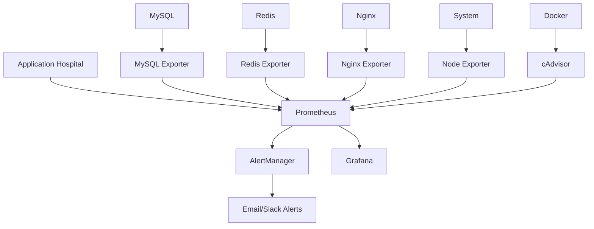

# 📊 Guide de Monitoring - Prometheus & Grafana

## 🎯 Vue d'Ensemble

Ce système de monitoring complet utilise **Prometheus** pour la collecte de métriques et **Grafana** pour la visualisation, spécialement adapté pour votre application de gestion hospitalière.

## 🏗️ Architecture du Monitoring



## 🚀 Démarrage Rapide

### 1. Démarrage Automatique
```bash
# Rendre le script exécutable
chmod +x scripts/start-monitoring.sh

# Démarrer tout le système de monitoring
./scripts/start-monitoring.sh
```

### 2. Démarrage Manuel
```bash
# Démarrer l'application principale
docker-compose up -d

# Démarrer le monitoring
docker-compose -f docker-compose.monitoring.yml up -d
```

## 🔗 Accès aux Services

| Service | URL | Identifiants | Description |
|---------|-----|--------------|-------------|
| **Grafana** | http://localhost:3001 | admin/admin123 | Dashboards et visualisation |
| **Prometheus** | http://localhost:9090 | - | Métriques et requêtes |
| **AlertManager** | http://localhost:9093 | - | Gestion des alertes |
| **Node Exporter** | http://localhost:9100 | - | Métriques système |
| **cAdvisor** | http://localhost:8080 | - | Métriques conteneurs |

## 📈 Métriques Disponibles

### 🏥 Métriques Métier (Application)
- `hospital_active_patients` - Nombre de patients actifs
- `hospital_total_beds` - Nombre total de lits
- `hospital_available_beds` - Lits disponibles
- `hospital_appointments_today` - Rendez-vous du jour
- `hospital_pending_appointments` - RDV en attente
- `hospital_total_doctors` - Nombre de médecins
- `hospital_beds_by_service{service="..."}` - Lits par service

### 🖥️ Métriques Système
- `node_cpu_seconds_total` - Usage CPU
- `node_memory_MemTotal_bytes` - Mémoire totale
- `node_memory_MemAvailable_bytes` - Mémoire disponible
- `node_filesystem_avail_bytes` - Espace disque libre

### 🐳 Métriques Conteneurs
- `container_cpu_usage_seconds_total` - CPU par conteneur
- `container_memory_usage_bytes` - Mémoire par conteneur
- `container_network_receive_bytes_total` - Trafic réseau

### 🗄️ Métriques Base de Données
- `mysql_global_status_threads_connected` - Connexions MySQL
- `mysql_global_status_queries` - Requêtes MySQL
- `redis_connected_clients` - Clients Redis connectés

## 📊 Dashboards Grafana

### 1. **Hospital Management - Vue d'ensemble**
- Métriques métier en temps réel
- Taux d'occupation des lits
- Activité des rendez-vous
- Performance de l'API

### 2. **Système & Infrastructure**
- Usage CPU, mémoire, disque
- Métriques réseau
- État des conteneurs Docker

### 3. **Base de Données**
- Connexions MySQL
- Performance des requêtes
- État Redis

## 🚨 Système d'Alertes

### Alertes Critiques
- **Backend Down** - Application indisponible
- **Database Down** - Base de données inaccessible
- **High Error Rate** - Taux d'erreur > 5%
- **Low Bed Availability** - < 10% de lits disponibles

### Alertes Warning
- **High CPU Usage** - CPU > 80%
- **High Memory Usage** - Mémoire > 85%
- **High Response Time** - Temps de réponse > 2s
- **High Patient Load** - > 500 patients actifs

## 🔧 Configuration Avancée

### Personnaliser les Alertes

Éditez `monitoring/prometheus/alert_rules.yml` :

```yaml
- alert: CustomHospitalAlert
  expr: hospital_custom_metric > 100
  for: 5m
  labels:
    severity: warning
  annotations:
    summary: "Alerte personnalisée"
    description: "Métrique personnalisée dépassée"
```

### Ajouter des Métriques Personnalisées

Dans `MetricsController.php` :

```php
// Nouvelle métrique
$output[] = "# HELP hospital_custom_metric Description de la métrique";
$output[] = "# TYPE hospital_custom_metric gauge";
$output[] = "hospital_custom_metric {$customValue}";
```

### Configurer les Notifications

Éditez `monitoring/alertmanager/alertmanager.yml` :

```yaml
receivers:
  - name: 'slack-alerts'
    slack_configs:
      - api_url: 'YOUR_SLACK_WEBHOOK_URL'
        channel: '#hospital-alerts'
        title: 'Alerte Système Hospitalier'
```

## 📋 Maintenance

### Commandes Utiles

```bash
# Voir les logs du monitoring
docker-compose -f docker-compose.monitoring.yml logs -f

# Redémarrer un service
docker-compose -f docker-compose.monitoring.yml restart grafana

# Vérifier l'état des services
docker-compose -f docker-compose.monitoring.yml ps

# Nettoyer les données (ATTENTION: Perte de données)
docker-compose -f docker-compose.monitoring.yml down -v
```

### Sauvegarde des Données

```bash
# Sauvegarder les données Grafana
docker cp hospital_grafana:/var/lib/grafana ./backup/grafana-$(date +%Y%m%d)

# Sauvegarder les données Prometheus
docker cp hospital_prometheus:/prometheus ./backup/prometheus-$(date +%Y%m%d)
```

### Restauration

```bash
# Restaurer Grafana
docker cp ./backup/grafana-20231029 hospital_grafana:/var/lib/grafana

# Redémarrer le service
docker-compose -f docker-compose.monitoring.yml restart grafana
```

## 🎯 Métriques Personnalisées pour l'Hôpital

### Exemples de Requêtes Prometheus

```promql
# Taux d'occupation des lits
(hospital_total_beds - hospital_available_beds) / hospital_total_beds * 100

# Évolution des patients sur 24h
increase(hospital_active_patients[24h])

# Charge moyenne des rendez-vous par heure
rate(hospital_appointments_today[1h]) * 3600

# Disponibilité du système (uptime)
up{job="hospital-backend"}
```

### Dashboards Personnalisés

Créez vos propres dashboards dans Grafana :

1. **Accédez à Grafana** : http://localhost:3001
2. **Cliquez sur "+"** → Dashboard
3. **Ajoutez un panel** avec vos requêtes
4. **Configurez les seuils** et alertes

## 🔍 Dépannage

### Problèmes Courants

#### Grafana n'affiche pas de données
```bash
# Vérifier la connexion Prometheus
curl http://localhost:9090/api/v1/query?query=up

# Vérifier les logs Grafana
docker logs hospital_grafana
```

#### Métriques application manquantes
```bash
# Tester l'endpoint métriques
curl http://localhost:8000/api/metrics

# Vérifier les logs backend
docker logs hospital_backend
```

#### Alertes non envoyées
```bash
# Vérifier AlertManager
curl http://localhost:9093/api/v1/alerts

# Tester la configuration email
docker logs hospital_alertmanager
```

## 📊 Tableaux de Bord Recommandés

### 1. Vue Opérationnelle (Direction)
- Nombre de patients traités
- Taux d'occupation des services
- Temps d'attente moyen
- Revenus générés

### 2. Vue Technique (IT)
- Performance des serveurs
- Temps de réponse API
- Erreurs applicatives
- Usage des ressources

### 3. Vue Médicale (Personnel)
- Charge de travail par médecin
- Disponibilité des équipements
- Urgences en cours
- Planning des interventions

## 🚀 Évolutions Futures

### Intégrations Possibles
- **Elastic Stack** pour les logs centralisés
- **Jaeger** pour le tracing distribué
- **Kubernetes** pour l'orchestration avancée
- **Machine Learning** pour la prédiction de charge

### Métriques Avancées
- Prédiction de la charge patient
- Optimisation automatique des ressources
- Détection d'anomalies comportementales
- Analyse de performance en temps réel

---

## 📞 Support

Pour toute question sur le monitoring :
1. Consultez les logs : `docker-compose -f docker-compose.monitoring.yml logs`
2. Vérifiez la configuration Prometheus : http://localhost:9090/config
3. Testez les métriques : http://localhost:8000/api/metrics
