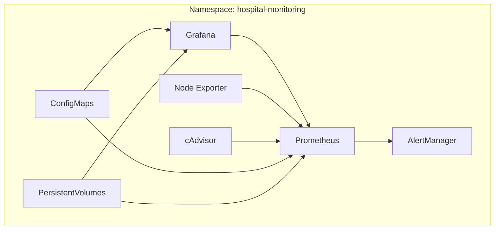

# 🚀 Déploiement Kubernetes - Système de Monitoring Hospitalier

## 🎯 Vue d'Ensemble

Ce dossier contient tous les fichiers YAML nécessaires pour déployer le système de monitoring complet sur un cluster Kubernetes.

## 📋 Architecture Kubernetes



## 🗂️ Structure des Fichiers

```
k8s/
├── namespace.yaml              # Namespace hospital-monitoring
├── persistent-volumes.yaml     # PV et PVC pour stockage
├── prometheus-config.yaml      # Configuration Prometheus
├── grafana-config.yaml         # Configuration Grafana
├── prometheus-deployment.yaml  # Deployment + Service Prometheus
├── grafana-deployment.yaml     # Deployment + Service Grafana
├── node-exporter-deployment.yaml # DaemonSet Node Exporter
├── cadvisor-deployment.yaml    # DaemonSet cAdvisor
├── alertmanager-deployment.yaml # Deployment AlertManager
├── deploy.ps1                  # Script de déploiement
├── test-k8s.ps1               # Script de test
└── README.md                   # Cette documentation
```

## 🚀 Déploiement Rapide

### **Prérequis**
- Kubernetes cluster (local ou distant)
- kubectl configuré
- Minikube (pour test local)

### **Option 1 : Avec Minikube (Recommandé pour test)**

```powershell
# Installer Minikube si nécessaire
# https://minikube.sigs.k8s.io/docs/start/

# Déployer avec Minikube
.\k8s\deploy.ps1 -Minikube

# Tester le déploiement
.\k8s\test-k8s.ps1 -Minikube
```

### **Option 2 : Cluster Kubernetes Existant**

```powershell
# Déployer sur cluster existant
.\k8s\deploy.ps1

# Tester le déploiement
.\k8s\test-k8s.ps1
```

### **Option 3 : Déploiement Manuel**

```bash
# Créer le namespace
kubectl apply -f k8s/namespace.yaml

# Déployer les volumes persistants
kubectl apply -f k8s/persistent-volumes.yaml

# Déployer les configurations
kubectl apply -f k8s/prometheus-config.yaml
kubectl apply -f k8s/grafana-config.yaml

# Déployer les services
kubectl apply -f k8s/prometheus-deployment.yaml
kubectl apply -f k8s/grafana-deployment.yaml
kubectl apply -f k8s/node-exporter-deployment.yaml
kubectl apply -f k8s/cadvisor-deployment.yaml
kubectl apply -f k8s/alertmanager-deployment.yaml
```

## 🔗 Accès aux Services

### **Avec Minikube**
```bash
# Obtenir l'IP de Minikube
minikube ip

# Services disponibles
# Grafana: http://<MINIKUBE_IP>:30300 (admin/admin123)
# Prometheus: http://<MINIKUBE_IP>:30090
# AlertManager: http://<MINIKUBE_IP>:30093
# cAdvisor: http://<MINIKUBE_IP>:30080
```

### **Avec Port-Forward**
```bash
# Grafana
kubectl port-forward service/grafana-service 3000:3000 -n hospital-monitoring

# Prometheus
kubectl port-forward service/prometheus-service 9090:9090 -n hospital-monitoring

# AlertManager
kubectl port-forward service/alertmanager-service 9093:9093 -n hospital-monitoring
```

## 📊 Ressources Déployées

### **Deployments**
- **Prometheus** : 1 replica, 512Mi RAM, 250m CPU
- **Grafana** : 1 replica, 256Mi RAM, 100m CPU
- **AlertManager** : 1 replica, 128Mi RAM, 50m CPU

### **DaemonSets**
- **Node Exporter** : Sur chaque nœud, 64Mi RAM, 50m CPU
- **cAdvisor** : Sur chaque nœud, 128Mi RAM, 100m CPU

### **Services**
- **NodePort** pour accès externe (30090, 30300, 30093, 30080)
- **ClusterIP** pour communication interne

### **Stockage**
- **Prometheus** : 10Gi PersistentVolume
- **Grafana** : 5Gi PersistentVolume

## 🔧 Commandes Utiles

### **Monitoring des Pods**
```bash
# État des pods
kubectl get pods -n hospital-monitoring

# Logs en temps réel
kubectl logs -f deployment/prometheus -n hospital-monitoring
kubectl logs -f deployment/grafana -n hospital-monitoring

# Description détaillée
kubectl describe pod <POD_NAME> -n hospital-monitoring
```

### **Debugging**
```bash
# Événements du namespace
kubectl get events -n hospital-monitoring --sort-by=.metadata.creationTimestamp

# État des PVC
kubectl get pvc -n hospital-monitoring

# Configuration des services
kubectl get svc -n hospital-monitoring -o wide
```

### **Mise à l'Échelle**
```bash
# Scaler Prometheus
kubectl scale deployment prometheus --replicas=2 -n hospital-monitoring

# Scaler Grafana
kubectl scale deployment grafana --replicas=2 -n hospital-monitoring
```

## 🔒 Sécurité

### **RBAC (à implémenter)**
```yaml
# Exemple de ServiceAccount pour Prometheus
apiVersion: v1
kind: ServiceAccount
metadata:
  name: prometheus
  namespace: hospital-monitoring
```

### **Network Policies (optionnel)**
```yaml
# Restriction d'accès réseau
apiVersion: networking.k8s.io/v1
kind: NetworkPolicy
metadata:
  name: prometheus-netpol
  namespace: hospital-monitoring
spec:
  podSelector:
    matchLabels:
      app: prometheus
  policyTypes:
  - Ingress
  - Egress
```

## 📈 Métriques Kubernetes

### **Métriques Disponibles**
- **kube-state-metrics** (à ajouter)
- **Métriques des pods** via cAdvisor
- **Métriques des nœuds** via Node Exporter
- **Métriques de l'API Server** Kubernetes

### **Requêtes PromQL Utiles**
```promql
# Pods par namespace
count by (namespace) (kube_pod_info)

# Usage CPU des conteneurs
rate(container_cpu_usage_seconds_total[5m])

# Usage mémoire des pods
container_memory_usage_bytes / container_spec_memory_limit_bytes * 100
```

## 🚨 Alertes Kubernetes

### **Alertes Configurées**
- Pod en CrashLoopBackOff
- Nœud non disponible
- Usage élevé des ressources
- PersistentVolume plein

## 🔄 Mise à Jour

### **Rolling Update**
```bash
# Mettre à jour l'image Prometheus
kubectl set image deployment/prometheus prometheus=prom/prometheus:v2.40.0 -n hospital-monitoring

# Vérifier le rollout
kubectl rollout status deployment/prometheus -n hospital-monitoring

# Rollback si nécessaire
kubectl rollout undo deployment/prometheus -n hospital-monitoring
```

## 🧹 Nettoyage

```powershell
# Supprimer tout le déploiement
.\k8s\deploy.ps1 -Delete

# Ou manuellement
kubectl delete namespace hospital-monitoring

# Arrêter Minikube
minikube stop
minikube delete
```

## 🎯 Prochaines Étapes

1. **Ajouter kube-state-metrics** pour métriques Kubernetes
2. **Implémenter RBAC** pour la sécurité
3. **Configurer Ingress** pour l'accès externe
4. **Ajouter Helm Charts** pour faciliter le déploiement
5. **Intégrer avec CI/CD** pour déploiement automatique

## 📞 Support

- **Logs** : `kubectl logs -f deployment/<SERVICE> -n hospital-monitoring`
- **Events** : `kubectl get events -n hospital-monitoring`
- **Dashboard** : `minikube dashboard` (si Minikube)
- **Port-forward** : Pour accès local aux services
